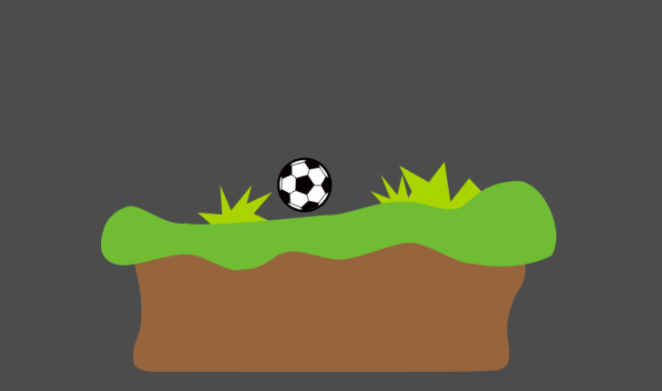

# First Contact

Proyecto mínimo para empezar con [Godot Engine](https://godotengine.org/). Lo usamos en [Zenvoid Studio](https://games.zenvoid.org/) como ejemplo didáctico básico para una persona que no ha utilizado previamente Godot ni motores de creación de videojuegos similares, para mostrar los conceptos de directorio de proyecto, editor, escenas, nodos, sprites, colisiones y objetos con física.

---

**English**: Minimal project to start with [Godot Engine](https://godotengine.org/). It's used by [Zenvoid Studio](https://games.zenvoid.org/) as a basic instructive material for people who has never used Godot nor similar videogame creation engines, to show the concepts of project's directory, editor, scenes, nodes, sprites, collisions and objects with physics.
